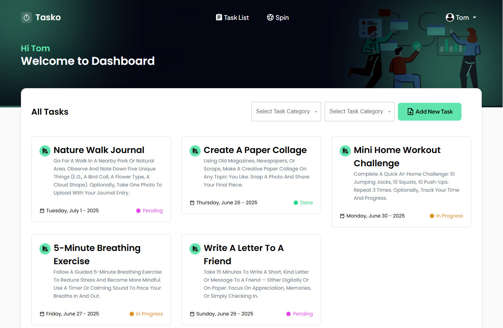
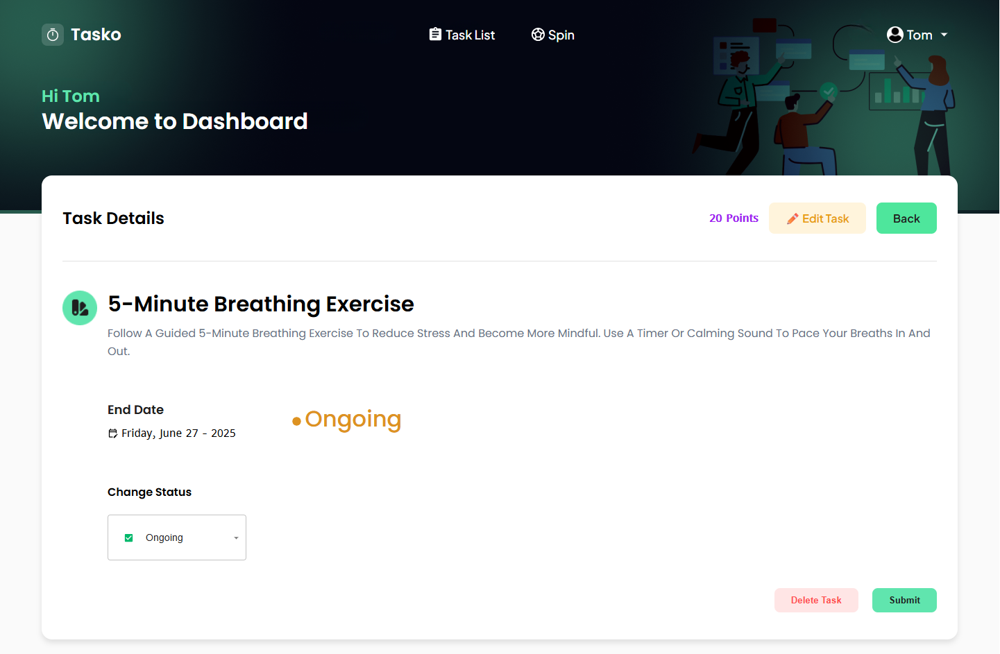
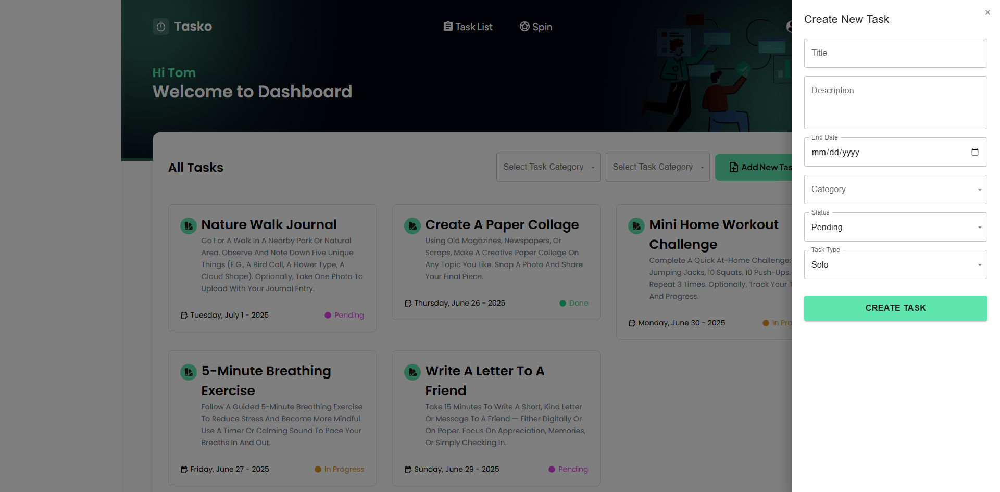
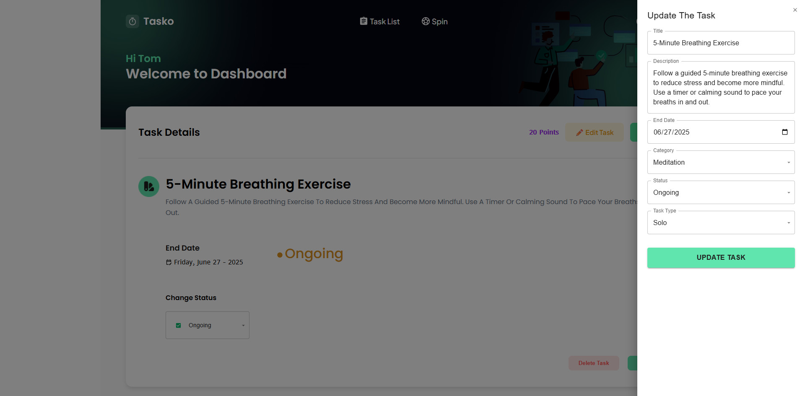
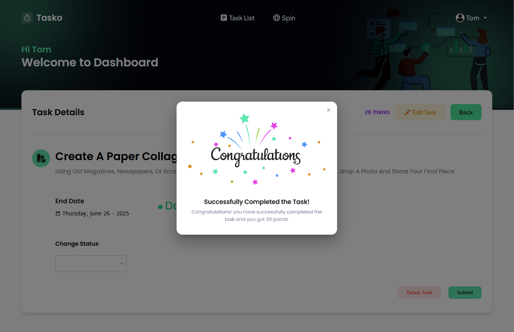
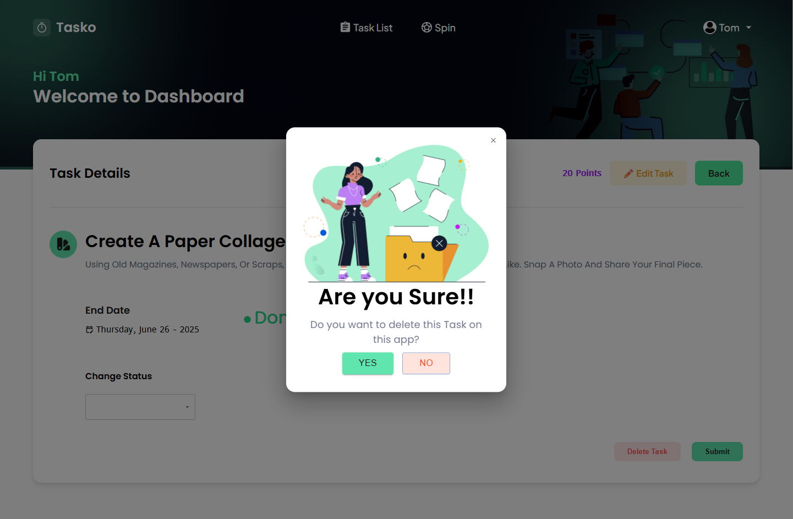
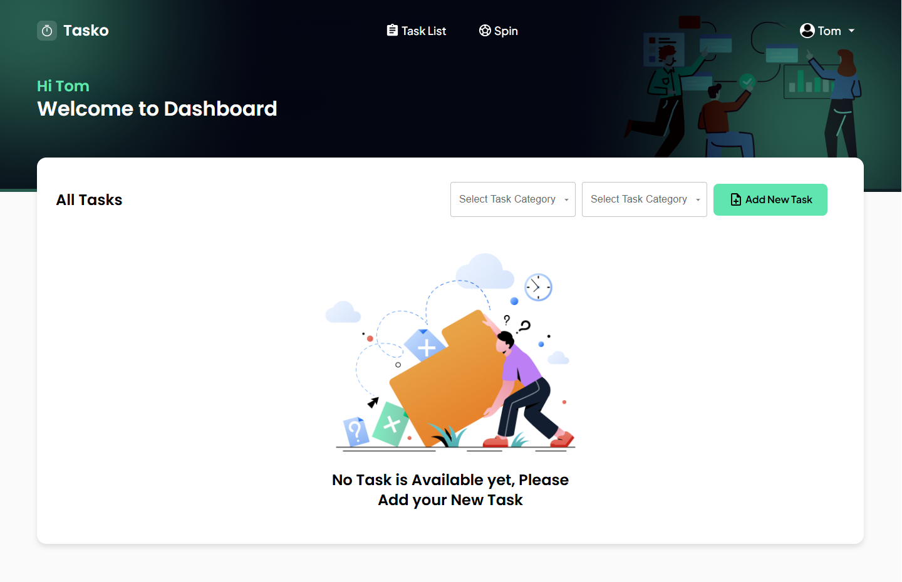
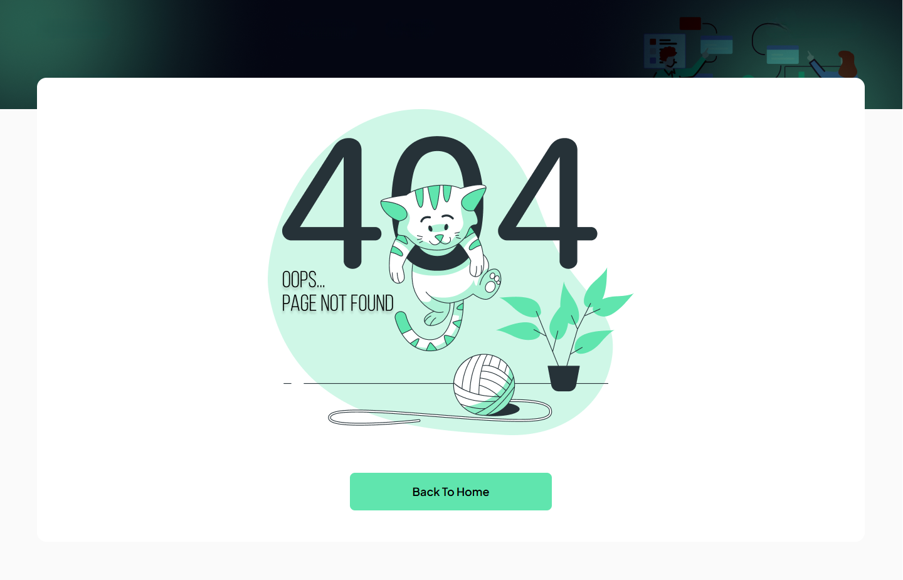

# Task Management App 📝

A task management application built with React, Material UI, React Hook Form, Express, and MongoDB. Users can create, update, and organize their tasks with ease. The app supports secure login and route protection using JWT stored in cookies.

---

## 🚀 Live Demo  
👉 [View Live Site](https://tasko-softvence-adnan.vercel.app/login)

---

## 🛠 Tech Stack

### 🔹 Frontend:
- React (via Vite)
- Material UI
- Redux Toolkit (State Management)
- React Hook Form (Form Validation)
- Axios (API Communication)
- React Router
- React Toastify

### 🔹 Backend:
- Express
- MongoDB & Mongoose
- JWT (Authentication)
- BcryptJS (Password Hashing)
- Cookie-parser
- CORS
- Helmet (HTTP Headers Security)
- dotenv (Environment Variables)
- Express-validator (Input Validation)

---
## 📸 Screenshots

### Task List

### Task Details

### Create Task

### Edit Task

### Complete Confirmation

### Delete Confirmation

### Empty Task List

### Not Found Page

> 📂 All screenshots are located in the `screenshots/` folder.

---

## ✨ Features
- Add, edit, and delete tasks  
- Category, status, and type filtering  
- Protected routes using JWT auth  
- Form validation with custom error messages  

## 🧠 Author

**Md Adnan Faruk**  
Feel free to reach out for feedback!

